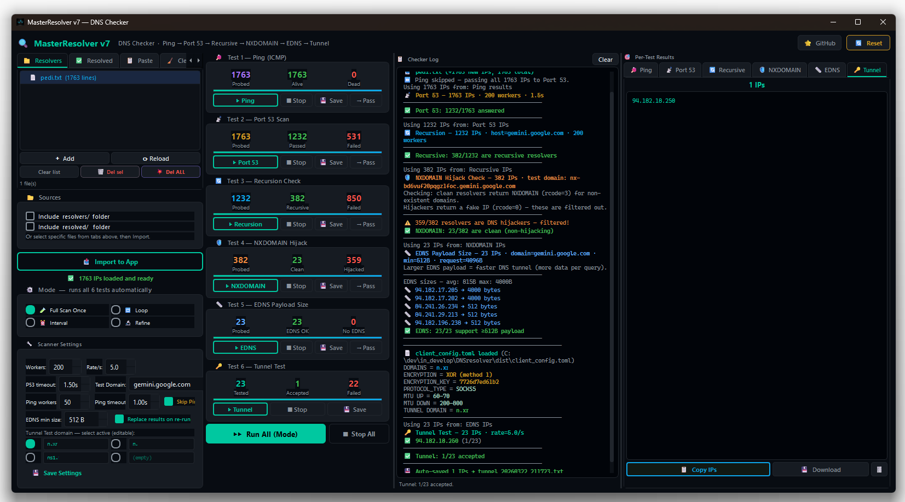

# MasterResolver

**A GUI-based DNS resolver scanner for [MasterDnsVPN](https://github.com/masterking32/MasterDnsVPN).**

When you run MasterDnsVPN, it tunnels your traffic through open DNS resolvers — but finding ones that actually work with your server's domain takes time. This tool scans thousands of IPs through a six-stage pipeline and hands you only the resolvers that pass every test, ready to drop into your client config.



---

## Background

The idea came from [findns](https://github.com/mosajjal/findns), a solid CLI scanner written in Go. MasterResolver covers the same ground but adds a full GUI, Windows `.exe` support, and two extra stages (NXDOMAIN hijack detection and EDNS payload size testing) that matter specifically for DNS tunneling. It also runs the final tunnel test against MasterDnsVPN's own MTU engine, so you're not guessing — you're testing the actual path.

---

## The Pipeline

Every IP you load gets pushed through these six stages in order. Failed IPs are dropped at each step, so the expensive tests only ever run on the small set of survivors.

```
1. Ping (ICMP)
   Pre-filter. Removes IPs that don't respond at all.
   Can be skipped — most public DNS resolvers block ICMP by firewall.

2. Port 53 Scan
   Checks whether UDP/TCP port 53 is open and returns any DNS response.

3. Recursion Check
   Queries a real domain. The resolver must return a valid answer with
   at least one record — confirming it actually resolves, not just echoes.

4. NXDOMAIN / Hijack Detection
   Queries a randomly generated non-existent subdomain.
   A clean resolver returns NXDOMAIN (rcode=3).
   ISP hijackers return a fake IP — those get filtered here.
   This step is critical for tunneling: hijacked resolvers corrupt your packets.

5. EDNS Payload Size
   Sends an EDNS0 OPT query. Measures the maximum UDP payload the resolver
   advertises. Larger = more data per DNS query = faster tunnel throughput.
   Resolvers below your configured minimum are dropped.

6. Tunnel Test (MasterDnsVPN MTU Engine)
   The real end-to-end test. Uses MasterDnsVPN's own client engine to run
   an MTU discovery handshake against your domain. Only resolvers that
   complete both upload and download MTU negotiation are accepted.
```

The pipeline runs in **Full Scan Once**, **Loop**, **Interval**, or **Refine** mode. Refine mode re-feeds accepted IPs back through the pipeline repeatedly until the quality stabilizes.

---

## Features

- Full six-stage scanner pipeline with live progress per stage
- Each test can also run independently — pick any stage, feed it any IP list
- "Pass on" button sends one test's results directly as input to the next
- Replace-on-rerun: re-running a test clears stale results instead of appending
- Test Domain for stages 2–5 is separate from Tunnel domains (stages 1–6)
- Up to four Tunnel domain slots with radio selection — useful when your server has multiple NS records
- Scanner settings (workers, timeouts, EDNS threshold, domains) persist to `resolver_settings.json`
- Config viewer: clicking Tunnel Test prints your active `client_config.toml` values to the log before running
- Paste raw text → extract IPs → auto-load into scanner in one click
- Export results per test or copy to clipboard
- Ships as a standalone `.exe` — no Python installation needed on the target machine

---

## Comparison with findns

| Feature | findns | MasterResolver |
|---|---|---|
| Interface | CLI (TUI) | GUI |
| Ping/ICMP | ✅ | ✅ (skippable) |
| Port 53 Scan | ✅ | ✅ |
| Recursion Check | ✅ | ✅ |
| NXDOMAIN Hijack Detection | ✅ | ✅ |
| EDNS Payload Size | ✅ | ✅ |
| DoH (DNS-over-HTTPS) | ✅ | ❌ |
| End-to-End Tunnel Test | dnstt / slipstream | MasterDnsVPN MTU engine |
| Windows `.exe` | ❌ | ✅ |
| Persistent settings | ❌ | ✅ |
| Per-test result export | ❌ | ✅ |

---

## Requirements (running from source)

```
Python 3.10+
PyQt6
loguru
zstd (optional, for compression support)
```

Install dependencies:
```bash
pip install -r requirements.txt
```

Run:
```bash
python resolver_gui.pyw
```

---

## Building the `.exe`

```bash
pip install pyinstaller

C:\Users\...\Python313\Scripts\pyinstaller.exe --onefile --windowed --name MasterResolver ^
  --icon assets/masterdnsvpn.ico ^
  --add-data "assets;assets" ^
  --add-data "dns_utils;dns_utils" ^
  --hidden-import dns_utils.ARQ ^
  --hidden-import dns_utils.DNSBalancer ^
  --hidden-import dns_utils.DNS_ENUMS ^
  --hidden-import dns_utils.DnsPacketParser ^
  --hidden-import dns_utils.DnsResponseCache ^
  --hidden-import dns_utils.PacketQueueMixin ^
  --hidden-import dns_utils.PingManager ^
  --hidden-import dns_utils.PrependReader ^
  --hidden-import dns_utils.compression ^
  --hidden-import dns_utils.config_loader ^
  --hidden-import dns_utils.utils ^
  --hidden-import loguru ^
  resolver_gui.pyw
```

The output is `dist/MasterResolver.exe`. Copy these files next to it before distributing:

```
dist/
├── MasterResolver.exe
├── client_config.toml
├── build_version.py
├── resolvers/       ← put your .txt IP lists here
└── resolved/        ← accepted resolvers land here
```

---

## Related

- [MasterDnsVPN](https://github.com/masterking32/MasterDnsVPN) — the tunnel client this tool was built around
- [findns](https://github.com/mosajjal/findns) — the CLI scanner that inspired the pipeline design

---

## License

MIT
